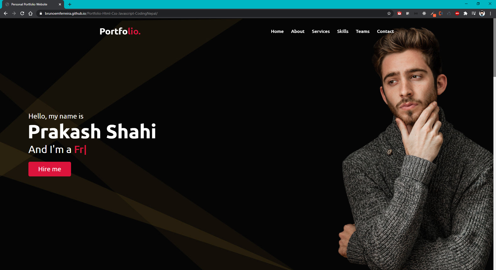
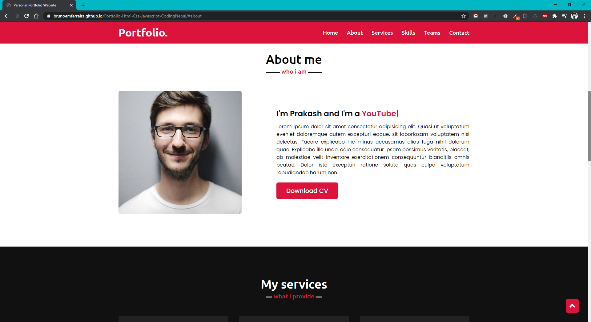
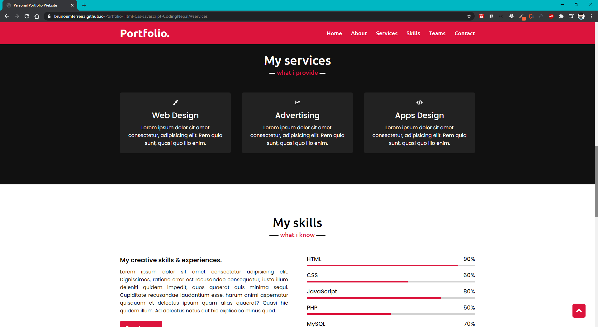
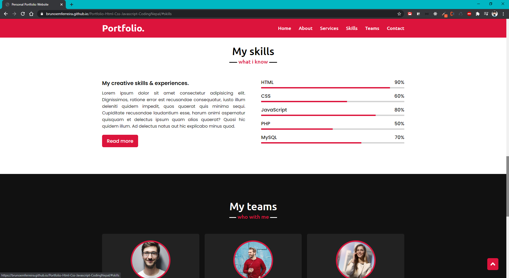
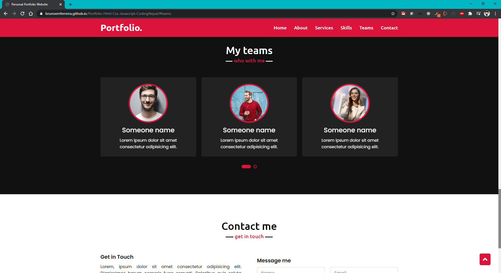
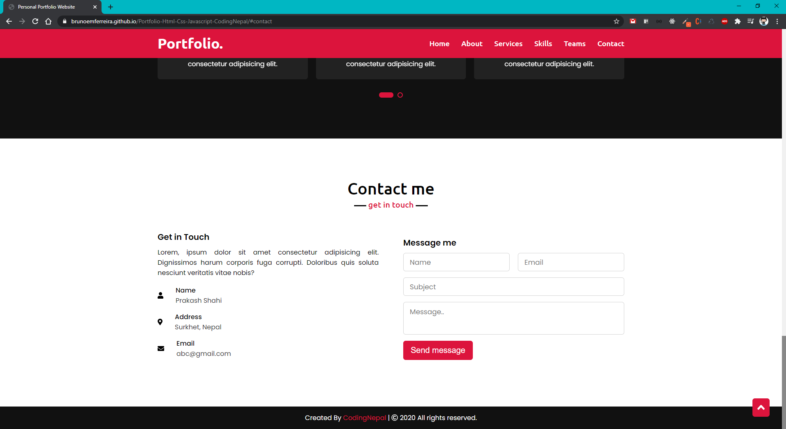

<h1 align="center"> Portfólio Responsivo em HTML/CSS/JavaScript - CodingNepal </h1>

<p align="center">
  
  
  
</p>

## 🚀 Sobre o Projeto
Clone desenvolvido utilizando como modelo Portfolio da CodingNepal, onde no mesmo é possível navegar entre as páginas Home, About, Services, Skills, Teams e Contacts rolando somente a barra lateral, projeto responsivo. 

## 🧰 Tecnologias Utilizadas
* VSCode ( IDE )
* HTML
* CSS
* JavaScript

## 🔗 Link do Projeto
[ 🌎 PortFólio](https://brunoemferreira.github.io/Portfolio-Html-Css-Javascript-CodingNepal/) - Projeto online no GitHub Pages

## 🖼️ Imagens do Projeto

<div align="center">
    
   </br>
   
   </br> 
    
   </br>
    
   </br>
     
   </br> 
    
</div>


## ⚙️ Rodando o Projeto
```bash
# Clone este repositório
$ git clone https://github.com/brunoemferreira/Portfolio-Html-Css-Javascript-CodingNepal.git

# Executando o Projeto
Utilize o plugin do VSCode LiveServer ou Abra o Arquivo index.html no browser de sua preferência 

```
## 🌐 Referências

[CodingNepal](https://www.codingnepalweb.com/) - Site Oficial CodingNepal.

[Projeto no Youtube](https://www.youtube.com/watch?v=tcskp-ncN0I) - Vídeo mostrando a construção do Portfólio.

---

⌨️ com ❤️ por [Bruno Eduardo](https://gist.github.com/brunoemferreira) 😊


